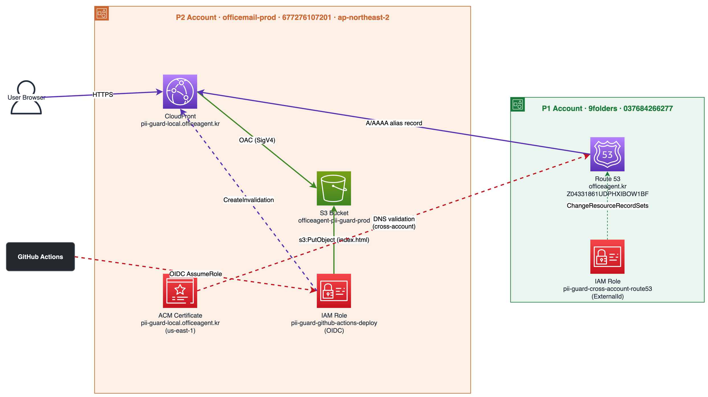

# pii-guard-js AWS Infrastructure

Pulumi TypeScript stack for deploying `pii-guard-js` (single-HTML static site) to AWS S3 + CloudFront.

## Architecture

> 📎 [aws-infrastructure.drawio](../../docs/architecture/aws-infrastructure.drawio) — editable in draw.io



## Resources

| Account | Resource | Identifier |
|---------|----------|------------|
| P2 (officemail-prod) | S3 Bucket | `officeagent-pii-guard-prod` |
| P2 (officemail-prod) | CloudFront Distribution | alias `pii-guard-local.officeagent.kr` |
| P2 (officemail-prod) | ACM Certificate | `pii-guard-local.officeagent.kr` (us-east-1) |
| P1 (9folders) | Route53 Hosted Zone | `officeagent.kr` (`Z04331861UDPHXIBOW1BF`) |
| P1 (9folders) | IAM Role | `pii-guard-cross-account-route53` |

## Deploy

```bash
# 1. Build the app (project root)
npm run build

# 2. Deploy with Pulumi
cd infra/pulumi
AWS_PROFILE=officemail-prod sp          # log in to S3 backend
pulumi stack select pii-guard-prod
pulumi up
```

On redeploy, `pulumi up` detects the changed `index.html` etag and uploads automatically.

CloudFront cache is invalidated automatically by GitHub Actions on every push to `main`.

## GitHub Actions (CI/CD)

The workflow at `.github/workflows/deploy.yml` runs on every push to `main`:

1. `npm run build` — produces `dist/index.html`
2. `aws s3 cp` — uploads to S3
3. `aws cloudfront create-invalidation` — invalidates CloudFront cache and waits for completion

Authentication uses OIDC — no long-lived AWS credentials stored in GitHub.

| Resource | Value |
|----------|-------|
| IAM Role (OIDC) | `arn:aws:iam::677276107201:role/pii-guard-github-actions-deploy` |
| Permissions | `s3:PutObject` on bucket + `cloudfront:CreateInvalidation` on distribution |

## Troubleshooting

See [`docs/troubleshooting/`](./docs/troubleshooting/) for incident records.
